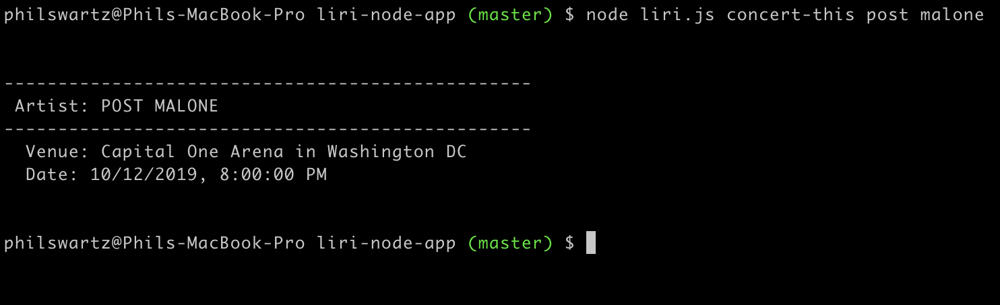
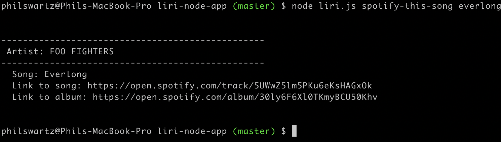
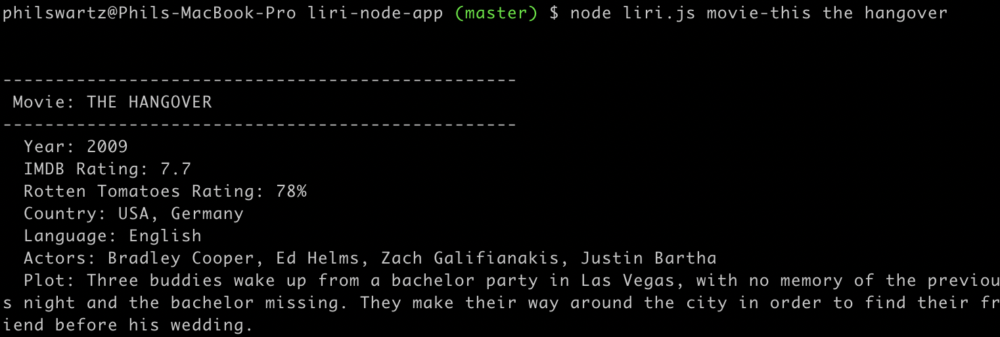
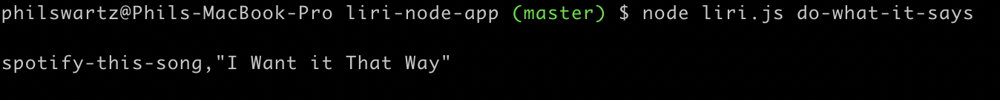

# liri-node-app

<h3>This project includes the following node dependencies:</h3>

<li>axios</li>
<li>node-spotify-api</li>
<li>dotenv</li>

<h4>To get started<h4>
  <li>git clone "'"this repo"'"</li>
  <li>run npm install</li>

<h2>Basic app commands</h2>

<li>concert-this</li>
<li>spotify-this-song</li>
<li>movie-this</li>
<li>do-what-it-says</li>

<h3>Sample use cases</h3>
<ol>
  <li>node liri.js concert-this <artist/band name here></li>
  <ul>Output: Name of the venue, Venue location, & Date of the event</ul>
   
  
  

   
   
  
  <li>node liri.js spotify-this-song <song name here></li>
  <ul>Output: Artist(s) name, Song name, Preview link of the song from Spotify, Album the song is on</ul>
   
  
  
  
  
   
   

  <li>node liri.js movie-this <movie name here></li>
  <ul>Output: Title, Year, IMDB Rating, Rotten Tomatoes Rating, Country, Language, Plot, Actors</ul>
   

  

   
   

  <li>node liri.js do-what-it-says</li>
  <ul>Output: will display random text</ul>

   
  
  
  
   
   

</ol>

